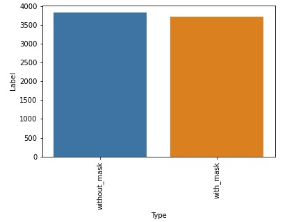
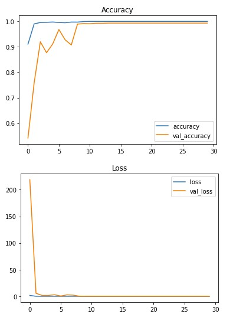
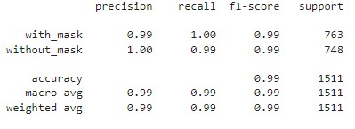
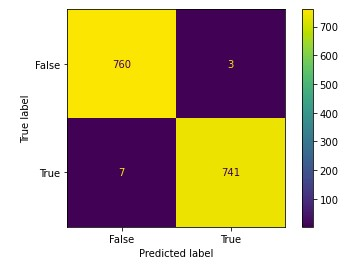

# Face-Mask-Detection

## Project Description 
This project was inspired by three of my classes for my final semester. I did my CS 4630 Undergraduate Seminar presentation presentation/essay on how facial recognition works using computer vision and machine learning. I am also taking CS 4210 Machine Learning this semester which went into further detail about how neural networks actually work as well as how to train them using python. Lastly, I wanted to learn how to integrate trained machine learning models into a web-app as I learned the entire decvelopment cycle to create a web application from scratch in CS 4800 Software Engineering. This project was inteded to be a culmination of everything I had learned from class and my own research this semester. Machine Learning and AI is one of my major interests as a sub-field of computer science so it was a great opportunity to create something on my own. 

I decided to create a web application using computer vision and machine learning that is able to detect whether people are wearing masks in real time. I also added the ability the recognize the faces that are registered in the database. 

## Training the Mask Detector Model

### 1. Dataset
The Dataset I used was from [Kaggle](https://www.kaggle.com/datasets/omkargurav/face-mask-dataset) which consisted of 7553 RGB images. It cosisted of 3725 images with masks and 3828 images without masks resulting in the classes being quite balanced. 

### 2. Model and Methodology Proposed

In order to classify objects in images, Convolutional Neural Networks (CNN) are most commonly used. Insead of creating one from scratch, I decided to use transfer learning with pre-trained models and fine-tune the final layers to fit my classification needs. Transfer learning is a machine learning technique that involves using knowledge gained from a previous task with a large dataset that is incorporated into a similar task in order to improve the performance of the new task as the model utilizes the previously learned information. By using a pre-trained model as a starting point, transfer learning significantly reduced the amount of data and time required to train a new model while increasing the accuracy. It also allows for testing  multiple models and variables to efficiently find which model best suits our task. Since the models are already trained on image datasets of over a million images each, they can easily detect edges and features in the images while the additional layers and training will allow it adhere to the specific task of mask detection on a person's face.

I decided to test the models ResNet50V2, MobileNetV2, and InceptionResNetV2 from the tensor flow keras library. 

### 3. Image Preprocessing

I used Keras' ImageDataGenerator class perform Image augmentation and flow_from_dataframe for further preprocessing. Image augmentation is used to prevent overfitting in models, especially with smaller datasets. It creates a lot more varaition in the data and exposes the models to many images that were not int he original dataset.

Hyper parameters:
- Normalization by dividing all pixel values by 255
- Rotation range of 20 degrees
- Vertical/Horizontal shift of 20%
- Slant of 20 degrees
- Allowing for horizontal flip

All images were also resized to 224 by 224 before using them to train the model.
 
### 4. Training

The final layers I added to fine tune these models included:
- Flatten layer
- Dense layer with 1024 Neurons and reli activation function
- Dropout layer with rate of 0.5
- Dense output layer with sigmoid activation function

The models were trained using an adam optimizer with a learning rate of 0.001 and binary_crossentropy loss function. I tested them all initially after running a couple epochs each but ended up choosing ResNet50V2 to run for 30 epochs for efficiency and accuracy. 

### 5. Results
Below show the accuracy and loss per epoch as well as the classification table and confusion matrix after running ResNet50V2 for 30 epochs. This took almost around a day to train. 

The model reached over 99% accuracy after the 12th epoch but kept running even though I had an early stopping function. Since the minimum change or min_delta was set to 0, there may have been minute improvements in accuracy.

## Integrating the Model to Web-Application

