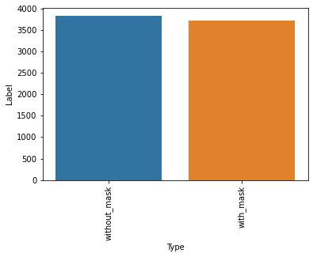

# Face-Mask-Detection

## Project Description 
This project was inspired by three of my classes for my final semester. I did my CS 4630 Undergraduate Seminar presentation presentation/essay on how facial recognition works using computer vision and machine learning. I am also taking CS 4210 Machine Learning this semester which went into further detail about how neural networks actually work as well as how to train them using python. Lastly, I wanted to learn how to integrate trained machine learning models into a web-app as I learned the entire decvelopment cycle to create a web application from scratch in CS 4800 Software Engineering. This project was inteded to be a culmination of everything I had learned from class and my own research this semester. Machine Learning and AI is one of my major interests as a sub-field of computer science so it was a great opportunity to create something on my own. 

I decided to create a web application using computer vision and machine learning that is able to detect whether people are wearing masks in real time. I also added the ability the recognize the faces that are registered in the database. 

## Training the Mask Detector Model

### 1. Dataset
The Dataset I used was from [Kaggle](https://www.kaggle.com/datasets/omkargurav/face-mask-dataset) which consisted of 7553 RGB images. It cosisted of 3725 images with masks and 3828 images without masks resulting in the classes being quite balanced. 

### 2. Model and Methodology Proposed
In order to classify objects in images, Convolutional Neural Networks (CNN) are most commonly used. Insead of creating one from scratch, I decided to use transfer learning with pre-trained models and fine-tune the final layers to fit my classification needs. Transfer learning is a machine learning technique that involves using knowledge gained from a previous task with a large dataset that is incorporated into a similar task in order to improve the performance of the new task as the model utilizes the previously learned information. To train a model to classify a picture with a person wearning a mask or not, several pre-trained models that had already been trained on large image-based datasets were used. The pre-trained models were then respectively fine-tuned the masked dataset. By using a pre-trained model as a starting point, transfer learning significantly reduced the amount of data and time required to train a new model while increasing the accuracy. It also allows for testing  multiple models and variables to efficiently find which model best suits our task. Since the models are already trained on image datasets of over a million images each, they can easily detect edges and features in the images while the additional layers add

By leveraging pre-trained models such as ResNet50 and MobileNetV2, the model can easily identify edges in images and learn specific layers to identify shapes and other features that are important for classifying malignant or benign moles. 

### 3. Image Preprocessing

I used Keras' ImageDataGenerator class perform Image augmentation and flow_from_dataframe for further preprocessing. 

### 4. Training
### 5. Results

